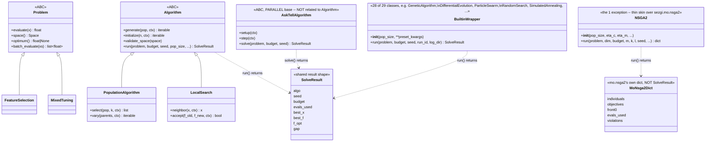

# Class hierarchy

sezgi's Python surface has three independent authoring paths into the same
Rust engine, plus one large family of ready-to-use wrapper classes. They
are **not** one inheritance tree — `AskTellAlgorithm` in particular is a
parallel base, not a subclass or superclass of `Algorithm`, because it
drives a completely different execution model (see
[The Python-callback bridge](rng-and-determinism.md#the-python-callback-bridge)
below for why).

## The four families

- **`sezgi.Problem`** (`problem.py`) — an ABC you subclass to declare a
  search space (`space()`) and an objective (`evaluate(x)`); optionally
  override `optimum()`/`batch_evaluate()`. `sezgi.recipes.FeatureSelection`
  and `sezgi.recipes.MixedTuning` (`recipes.py`) are its two concrete
  subclasses shipped in this milestone.
- **`sezgi.Algorithm`** (`algorithm.py`) — an ABC whose `generate(pop,
  ctx)` hook (required) runs *inside* the Rust engine loop, once per stage
  per generation, via `_sezgi.solve_with_py_generator`'s `PyGenerator`
  bridge. Two family bases sit below it: `PopulationAlgorithm` (adds
  `select`/`vary`, composing them into `generate`) and `LocalSearch` (adds
  `neighbor`/`accept`, pinned to `pop_size=1`).
- **`sezgi.AskTellAlgorithm`** (`algo.py`, formerly the top-level
  `sezgi.Algorithm` before this milestone's name repurposing) — an ABC
  whose `setup(ctx)`/`step(ctx)` hooks drive a pure-Python loop *over* the
  ask/tell `AlgoContext`/`EvalSession` core, entirely outside the Rust
  engine's own generation loop. Population bookkeeping, replacement, and
  termination are all the subclass's own responsibility here — the engine
  only supplies evaluation counting, budget enforcement, and a
  deterministic RNG stream.
- **The 29 built-in wrapper classes** (`builtins.py`) — one per
  `crates/components/src/presets.rs` preset builder (34 builders; some
  presets, like DE's three variants, are collapsed under one wrapper via a
  `variant=` kwarg), plus `NSGA2` (a thin `sezgi.mo.nsga2` skin, not a
  `presets.rs` builder). None of them is a `Problem`/`Algorithm` subclass —
  all 29 are plain `object` subclasses. **28 of the 29** share one uniform
  shape: `__init__(pop_size=..., **preset_kwargs)` then `run(problem,
  budget, seed=0, ...)`, internally building an `AlgorithmSpec` and calling
  `sezgi.solve()` (the same compat-layer entry point `sezgi.Algorithm.run`
  funnels its own result through, via the shared `_wrap_result` helper in
  `algo.py`). **`NSGA2` is the one exception**: its `__init__`/`run()`
  signatures mirror `sezgi.mo.nsga2`'s own multi-objective parameter set
  instead (`run(problem, dim, budget, m=None, seed=0, k=None, l=None,
  ...)`), and — per its own class docstring — `run()` returns
  `mo.nsga2`'s own raw dict (`individuals`, `objectives`, `front0`,
  `evals_used`, `violations` when constrained), **not**
  `sezgi.algo.SolveResult`: that dataclass's fields (`best_x`/`best_f`/
  `f_opt`/`gap`) assume a single-objective run with one best point, which
  does not fit a multi-objective Pareto front.

`sezgi.Algorithm`, `sezgi.AskTellAlgorithm`, and 28 of the 29 built-in
wrapper classes converge on one result shape: `sezgi.algo.SolveResult`
(`algo` name, `seed`, `budget`, `evals_used`, `best_x`, `best_f`, `f_opt`,
`gap`). `NSGA2` is the documented exception to that convergence — see
above.

## As a class diagram

<!-- Source: py-sezgi/python/sezgi/problem.py (`Problem` ABC); py-sezgi/python/sezgi/recipes.py (`FeatureSelection`, `MixedTuning`); py-sezgi/python/sezgi/algorithm.py (`Algorithm`, `PopulationAlgorithm`, `LocalSearch`); py-sezgi/python/sezgi/algo.py (`AskTellAlgorithm`, `SolveResult`, the module-level `Algorithm = AskTellAlgorithm` compat alias); py-sezgi/python/sezgi/builtins.py (the 29 wrapper classes, `_PRESET_TABLE`, `_run_spec`) -->

## The compat layer underneath

Three of these four families are genuinely one implementation underneath:
`sezgi.Algorithm.run`, the 29 built-in wrapper classes' `run()`, and a
hand-written spec passed straight to `sezgi.solve()` are different front
doors onto the *same* `sezgi.solve()` / `_sezgi.solve_with_py_generator()`
compat internals, which build an `AlgorithmSpec` and hand it to the one
`Engine::run` loop described in [Engine flow](engine-flow.md).

`sezgi.AskTellAlgorithm` is **not** part of that convergence — as its own
description above says, `AskTellAlgorithm.solve()` drives a pure-Python
`setup()`/`step()` loop directly over `EvalSession`'s ask/tell core; it
never builds an `AlgorithmSpec` and never calls `Engine::run` or
`solve_with_py_generator` at all. The engine only supplies that session's
own evaluation counting, budget enforcement, and deterministic RNG stream
— the generation loop itself is entirely `AskTellAlgorithm`'s own Python
code. See [Solve / compat internals](../api/compat.md) for the three
converging families' own reference.

## Next

- [Determinism and the RNG model](rng-and-determinism.md) explains how
  `Algorithm.run`'s `generate()` callback draws from the *exact same*
  seeded stream a built-in Rust `Generator` would have used at that call.
