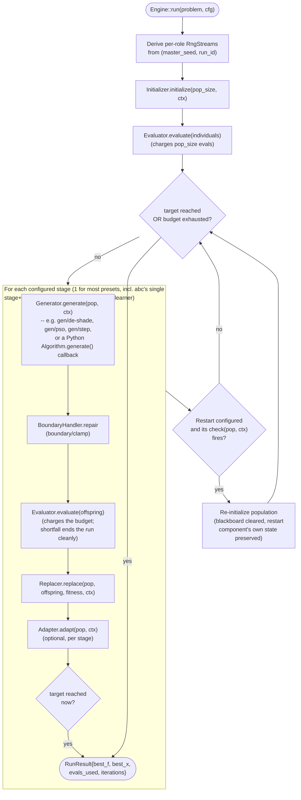

# Engine flow

Every sezgi run — whether it uses a built-in preset, a Python `Algorithm`
subclass, or a hand-written spec — executes through the same Rust loop:
`Engine::run` (`crates/core/src/engine.rs`). This page walks that loop
exactly as written, not as an idealized textbook version of it.

## The run, start to finish

`Engine::run` (`engine.rs:83-248`):

1. Builds an `Evaluator` wrapping the problem and the run's `budget`, and a
   fresh `Blackboard` (component-shared state).
2. Derives per-role RNG streams from `(master_seed, run_id)` — one for
   initialization, one for boundary repair, one generator/replacer pair
   per stage, one per adapter, one for restarts (see
   [Determinism and the RNG model](rng-and-determinism.md) for the exact
   derivation).
3. Runs the configured `Initializer` once to build the starting population,
   then evaluates it (charging `pop_size` evaluations against the budget).
4. Enters the outer loop, which repeats until a `target` fitness is reached
   or the budget is exhausted:
   - For **each configured stage** (most presets have one; `tlbo` is the
     only preset with two — `gen/tlbo-teacher` then `gen/tlbo-learner`,
     `presets.rs:600-620`. `abc` has one stage with an `Adapter` attached
     — its extra per-cycle evaluation cost comes from that adapter's own
     internal evaluations, not from a second engine stage,
     `presets.rs:695-708`):
     1. `Generator::generate(pop, ctx)` produces offspring.
     2. Boundary repair (`boundary/clamp` in every documented preset)
        repairs each offspring against the search space.
     3. `Evaluator::evaluate(offspring)` charges the budget; a budget
        shortfall here ends the run cleanly (`break 'outer`), keeping
        whatever `best_f`/`best_x` had already been observed.
     4. `Replacer::replace(pop, offspring, fitness, ctx)` decides the next
        population.
     5. The stage's optional `Adapter::adapt(pop, ctx)` runs, if configured
        (e.g. SHADE's success-history update, CMA-ES's covariance update).
     6. If `target` is now reached, the run stops immediately — even
        mid-stage, before any later stage in the same generation runs.
   - After all stages, an optional `Restart` component may re-initialize
     the population (preserving only the restart component's own declared
     blackboard state across the reset) — used by, e.g., CMA-ES-IPOP's
     stagnation restarts.
5. Returns a `RunResult { best_f, best_x, evals_used, iterations }`.
   `best_f`/`best_x` are read directly from the `Evaluator`'s own
   best-tracking — the minimum over **every** charged evaluation of the
   run, including ones an `Adapter` or `Generator` issued internally via
   its own `ctx.eval.evaluate(..)` call, not only the ones this loop's own
   per-stage `eval.evaluate(&offspring)` call re-observes.

Two details worth being explicit about, because they are easy to get
wrong in a simplified diagram: the budget check happens *inside*
`eval.evaluate(...)`, not as a separate "is there budget left?" test before
each stage — a stage that cannot afford its own offspring batch ends the
run there, mid-generation; and a `target` hit is checked once per stage,
immediately after that stage's own adapter call, so it can short-circuit
before any later stage in the same generation ever runs.

## The loop, as a diagram

<!-- Source: crates/core/src/engine.rs (`Engine::run`, lines 83-248: RNG stream derivation at 91-106, initialization at 108-122, the per-stage generate/repair/evaluate/replace/adapt sequence at 149-190, restart handling at 192-232, the RunResult construction at 237-248); crates/components/src/presets.rs:600-620 (`tlbo`, the only 2-stage preset) and :695-708 (`abc`, 1 stage with an adapter) -->

## Next

- [Class hierarchy](class-hierarchy.md) covers what sits *above* this
  loop, on the Python side.
