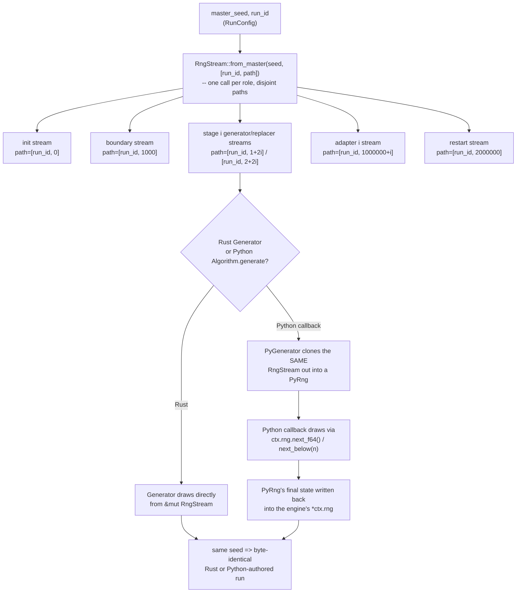
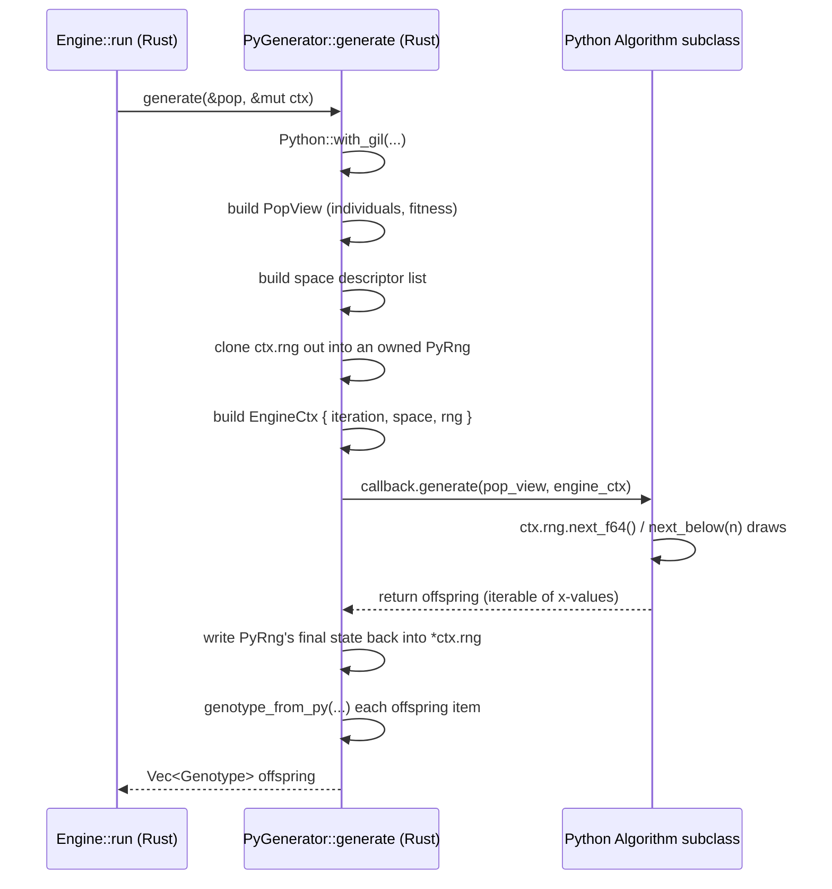

# Determinism and the RNG model

Every sezgi run is deterministic under a fixed `(master_seed, run_id)`: the
same triple `(problem, budget, seed)` (and, for multi-run experiments,
`run_id`) always produces byte-identical results — same `best_f`, same
`best_x`, same `evals_used` — in this build, run after run, and (for a
shared built-in algorithm) across the Python and R frontends alike. This
page explains the mechanism, both for the pure-Rust path and for a
Python-authored `Algorithm.generate()` callback.

## The generator: `RngStream`

sezgi's RNG core (`crates/core/src/rng.rs`) is a hand-written
xoshiro256++ generator (Blackman & Vigna 2019), seeded via SplitMix64
(Steele et al. 2014). Two operations matter for determinism:

- `RngStream::from_master(master_seed, path)` folds a master seed and an
  arbitrary `&[u64]` **path** down to one digest (via repeated SplitMix64
  mixing), then expands that digest into the four-word xoshiro state. Two
  calls with the same `(master_seed, path)` always produce the exact same
  stream.
- `RngStream::split(child_id)` derives an independent child stream from a
  parent stream's current path digest — used for restart-spawned
  sub-populations (`Engine::run`'s own `restart_rng.split(restart_count)`,
  `engine.rs:215`).

`golden_values_pinned` (`rng.rs`'s own test suite) pins three concrete
`u64` draws for `RngStream::from_master(123, &[1, 2])` — a regression test
that fails immediately if the implementation ever changes accidentally.

## One master seed, many independent streams

`Engine::run` derives a **separate** `RngStream` for every role, all from
the same `(master_seed, run_id)` but at different paths
(`engine.rs:91-106`):

| Role | Path |
|---|---|
| Initializer | `[run_id, 0]` |
| Boundary repair | `[run_id, 1000]` |
| Stage `i`'s generator | `[run_id, 1 + 2*i]` |
| Stage `i`'s replacer | `[run_id, 2 + 2*i]` |
| Stage `i`'s adapter | `[run_id, 1_000_000 + i]` |
| Restart | `[run_id, 2_000_000]` (children via `.split(restart_count)`) |

Because every role's path is disjoint, changing one component's behavior
(e.g. swapping a `Generator`) never perturbs another role's draw sequence
— `engine.rs`'s own test suite verifies this directly
(`stage_rng_streams_use_the_documented_per_stage_indices`,
`absent_adapter_and_restart_change_nothing`).

## The Python callback bridge

A Python-authored `Algorithm.generate(pop, ctx)` draws from `ctx.rng`
(`_sezgi.PyRng`, `py-sezgi/src/lib.rs`) — but `ctx.rng` is not a separate,
Python-only RNG. `PyGenerator::generate` (the Rust struct backing every
engine-hosted Python callback) **clones the engine's own stage `RngStream`
out** into an owned `PyRng` immediately before the call, hands it to Python
via `EngineCtx.rng`, and **writes its final state back** into the engine's
own `*ctx.rng` immediately after the callback returns — before offspring
conversion, so the write-back happens unconditionally. Every
`ctx.rng.next_f64()`/`next_below(n)` draw a Python callback makes therefore
flows through *exactly* the same house stream a built-in Rust `Generator`
would have used at that call: same seed ⇒ same sequence, regardless of
which language produced the offspring.

One consequence worth stating plainly: a `PyRng` handle a callback stashes
from a *past* call stays usable as an ordinary Python object, but drawing
from it no longer affects the engine's own stream — each `generate` call
hands out a fresh clone and writes back only that call's own handle, so a
stale stashed handle is permanently inert for run determinism (drawing from
it changes nothing but that stale copy).

## Seed to draw, as a diagram



<!-- Source: crates/core/src/rng.rs (`RngStream::from_master`/`split`, the xoshiro256++/SplitMix64 core); crates/core/src/engine.rs:91-106 (the per-role stream derivation table above); py-sezgi/src/lib.rs (`PyRng`, the clone-out/write-back protocol documented on `PyGenerator::generate`) -->

## The Python-callback bridge, call by call

`sezgi.Algorithm.run()` calls `_sezgi.solve_with_py_generator(self,
native_problem, budget, master_seed=seed, ...)`, which registers `self` as
a synthetic `"py/generator"` component and runs it through the exact same
`Engine::from_spec` + engine loop every built-in preset uses. Each time
that stage's `Generator::generate` is due, here is what actually happens
(`PyGenerator::generate`, `py-sezgi/src/lib.rs`):



A Python exception raised inside `generate`/`initialize`/`validate_space`
propagates unchanged (via `panic::panic_any(PyErr)`, caught by
`run_with_bridge`'s `catch_unwind`) — the same propagation pattern sezgi's
other Python-callback bridges (`call_callable`/`call_callable_spaced`) use.
`Algorithm.initialize` follows the identical clone-out/write-back protocol
via a mechanically parallel `PyInitializer` struct, registered only when a
subclass actually overrides `initialize` (detected by function-identity
comparison against `Algorithm.initialize` itself, in `algorithm.py`'s
`Algorithm.run`).

<!-- Source: py-sezgi/src/lib.rs (`solve_with_py_generator`, `PyGenerator::generate`, `PyInitializer`); py-sezgi/python/sezgi/algorithm.py (`Algorithm.run`'s call into `_sezgi.solve_with_py_generator`, and its own override-detection for `initialize`) -->

## A runnable determinism check

`_sezgi.PyRng.from_master` is documented as an advanced/testing surface —
exactly the tool needed to demonstrate the claim above directly, without
needing a full run:

```python exec="true" source="above"
from sezgi._sezgi import PyRng

a = PyRng.from_master(master_seed=42, path=[0, 1])
b = PyRng.from_master(master_seed=42, path=[0, 1])
c = PyRng.from_master(master_seed=42, path=[0, 2])

draws_a = [a.next_f64() for _ in range(3)]
draws_b = [b.next_f64() for _ in range(3)]
draws_c = [c.next_f64() for _ in range(3)]

print("same (master_seed, path) reproduces the same draws:", draws_a == draws_b)
print("a different path diverges immediately:", draws_a[0] != draws_c[0])
```

## Next

This is the last page of the concepts and architecture section. See the
[API reference](../api/spaces.md) for the full generated Python surface, or
return to the [Learn track](../learn/01-what-are-metaheuristics.md).
