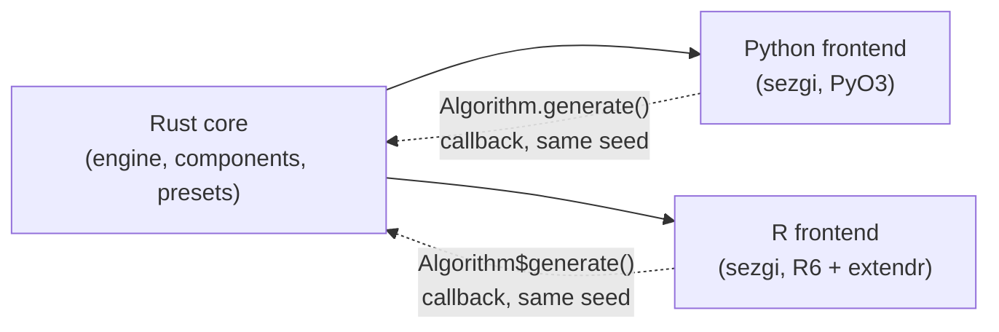

# sezgi

**sezgi** (Turkish for "intuition") is a Rust-core, component-based
metaheuristic optimization library with Python and R frontends.



One Rust engine drives both frontends; a Python or R `Algorithm`
subclass's `generate()`/`vary()`/`neighbor()` hook runs as a callback
*into* that same engine loop, not a separate reimplementation — this is
why a shared seed reproduces byte-identical runs across languages.

## Statement of need

Metaheuristic-optimization research has a reproducibility problem: papers
report algorithm comparisons whose RNG draw order, seeding scheme, and
even operator details are rarely pinned precisely enough to reproduce
byte-for-byte, and a cottage industry of metaphor-named "novel" algorithms
(see the equivalence-critique literature cited throughout the
repository's own `examples/README.md` — Camacho-Villalón, Dorigo &
Stützle; Weyland; Črepinšek et al.) often turns out to be a known method
wearing new vocabulary. sezgi exists for researchers, students, and
practitioners who want:

- **A pinned, deterministic core.** One Rust engine drives every
  algorithm; a run is fully determined by `(spec, problem, seed, budget)`,
  and the same inputs reproduce byte-identical results across Python and
  R.
- **Honest provenance.** Every built-in algorithm names its source
  (paper, or the author's own reference implementation) and states
  plainly where sezgi's own implementation is a documented simplification
  rather than a paper-faithful reproduction.
- **A real class-first API**, not a thin scripting shim — every built-in
  algorithm and every problem is a subclassable Python (and R6) class.

The audience is optimization researchers who need cross-language,
bit-exact reproducibility; students learning metaheuristics who want a
library that teaches the field's actual structure (selection/variation/
replacement, exploration/exploitation, encodings) rather than hiding it;
and practitioners who want a dependable, well-documented library rather
than a loose collection of reference scripts.

See [About > Statement of need](about/statement-of-need.md) for the
fuller, JOSS-style version of this statement, including an honest
comparison to pymoo, jMetal, and ecr.

## The class-first pitch

Every built-in algorithm is a class. Every problem is either a native
handle (`sezgi.bbob(...)`, `sezgi.problems.onemax(...)`, ...) or a
`sezgi.Problem` subclass you author yourself. `.run()` accepts either,
and every scalar wrapper's `.run()` returns the same `SolveResult` shape
regardless of which class produced it (`NSGA2`, the multi-objective
skin, returns its own result dictionary instead):

```python
import sezgi

problem = sezgi.bbob(1, 5, 1)  # BBOB f1 (Sphere), dim=5, instance=1
result = sezgi.GeneticAlgorithm(pop_size=20).run(problem, budget=1000, seed=1)
print(result.evals_used, result.best_f, result.gap)
```

See [Quickstart](quickstart.md) for the full, verified walk-through.

## Feature list

- **29 built-in algorithm classes** spanning genetic/evolutionary,
  swarm-intelligence, physics-inspired, and local-search families, each
  citing its source in its own class docstring (see
  [Built-in algorithm classes](api/builtins.md)). The honest parity-tier
  taxonomy behind those citations (labeled metaphor vs.
  author's-own-source vs. sezgi simplification) is maintained in the
  repository's `examples/README.md` algorithm catalog and in
  `crates/components/src/presets.rs`'s own doc comments, not restated
  per-tier on this site's API pages.
- **A subclassable `Algorithm`/`PopulationAlgorithm`/`LocalSearch`
  hierarchy** for authoring new algorithms that run *inside* the Rust
  engine loop (not a Python-owned ask/tell loop) — only the
  generation/variation/neighbor step is Python; budget tracking, boundary
  repair, evaluation counting, and IOH logging stay in Rust.
- **An `AskTellAlgorithm` ask/tell surface** for algorithms that are
  more naturally expressed as a Python-owned loop over an `EvalSession`.
- **Five space builders** (`Float`, `Int`, `Categorical`, `Binary`,
  `Permutation`) composable into mixed spaces via `Space(*blocks)`.
- **Multi-objective optimization** via NSGA-II over ZDT/DTLZ/WFG problem
  suites, with hypervolume and IGD indicators.
- **A benchmarking and statistics toolkit**: BBOB/CEC 2014/CEC
  2017/CEC 2022 suites, IOH-format logging, ECDF curves, COCO export, and
  a full statistical-comparison suite (Friedman, Wilcoxon+Holm, Cliff's
  delta, Bayesian signed-rank, Plackett-Luce).
- **A structural/central bias scanner** for auditing whether an
  algorithm's search behavior clusters away from uniform on a null
  problem.
- **Cross-language parity**: the R frontend (R6 classes) mirrors the
  Python surface 1:1 and is bit-exact against it for shared algorithms —
  see [R surface](r.md).

## Where to go next

- [Install](install.md) — `pip install sezgi` / `uv pip install sezgi`
  for Python, r-universe for R (development installs also documented).
- [Quickstart](quickstart.md) — the 10-line class-first path, run and
  verified.
- [Notebooks](notebooks/01-interactive-quickstart.ipynb) — the same ground
  as executed, downloadable Jupyter notebooks you can open and re-run
  yourself.
- [API reference](api/spaces.md) — the full Python API, auto-generated
  from the library's own docstrings.
- [R surface](r.md) — the R6 mirror and its documentation.
- [About](about/statement-of-need.md) — the full statement of need,
  state-of-the-field comparison, and community/contributing guidelines.
