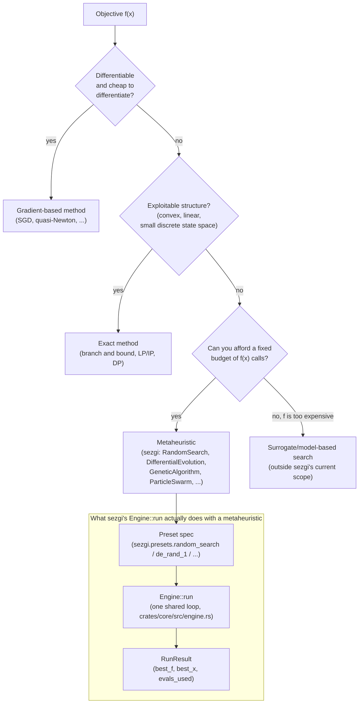

# What metaheuristics are, and when to use one

A **metaheuristic** is a general-purpose search strategy for finding a good
solution to an optimization problem when you can only *evaluate* candidate
solutions — call a function `f(x)` and get a number back — and cannot rely
on any special mathematical structure of `f` (differentiability, convexity,
linearity, ...). This is often called **black-box optimization**: the
optimizer never sees `f`'s formula, only its outputs.

## Why not an exact or gradient method?

Two large families of optimization methods exist alongside metaheuristics,
and each needs something a black-box problem usually cannot give it:

- **Exact methods** (branch and bound, linear/integer programming, dynamic
  programming) guarantee the true optimum, but need exploitable structure
  — convexity, linearity, a small enough discrete state space — and their
  worst-case running time is often exponential once that structure is gone.
- **Gradient-based methods** (gradient descent, quasi-Newton, ...) are fast
  and precise, but need `f` to be differentiable (and, in practice, for the
  gradient to be cheap to obtain). A simulation, a black-box scientific
  model, a combinatorial objective (a tour length, a schedule's makespan),
  or a noisy measurement usually offers no gradient at all.

A metaheuristic asks for none of that. It only needs to *call* `f(x)` and
compare the numbers that come back. The price is that it offers no
optimality guarantee — it searches, it does not solve — and its currency is
the **evaluation budget**: the total number of times `f` may be called
before the search must report its best answer. Every sezgi algorithm's
`run(..., budget=...)` argument is exactly this currency.

## No free lunch, stated honestly

Wolpert & Macready's "No Free Lunch" theorems (1997) show that, averaged
over *every possible* objective function, no optimizer outperforms any
other — including plain random search. This is not a discouraging trivia
fact; it is a warning against algorithm-shopping by reputation. A
metaheuristic's performance on the problems you actually care about is an
empirical question, not a theoretical one, and it must be answered by
running the algorithm on your problem (or a representative benchmark) under
a fixed budget and comparing honestly — the subject of
[Comparing algorithms fairly](05-comparing-algorithms-fairly.md).

## Two algorithms, the same problem, the same budget

Both `sezgi.RandomSearch` and `sezgi.DifferentialEvolution` are wrapper
classes over the exact same underlying engine (see
[Engine flow](../concepts/engine-flow.md)); they differ only in *how* they
turn the current population into new candidates.

```python exec="true" source="above"
import sezgi

problem = sezgi.bbob(1, 5, 1)  # BBOB f1 (Sphere), dim=5
budget, seed = 1000, 1

rs = sezgi.RandomSearch(pop_size=20).run(problem, budget=budget, seed=seed)
de = sezgi.DifferentialEvolution(pop_size=20).run(problem, budget=budget, seed=seed)

print(f"random_search:        best_f={rs.best_f:.6g} gap={rs.gap:.6g}")
print(f"differential_evolution: best_f={de.best_f:.6g} gap={de.gap:.6g}")
```

`RandomSearch` (`presets.rs`'s `random_search` — uniform resampling every
generation) has no mechanism to concentrate search near good points;
`DifferentialEvolution` does (it perturbs candidates using the *difference*
between other population members). On this one seeded run, the difference
is visible in the printed gap — but **one seeded run is an illustration,
not evidence**: see page 5 before drawing any conclusion from a result like
this one.

## The decision, as a diagram



<!-- Source: py-sezgi/python/sezgi/builtins.py (RandomSearch, DifferentialEvolution wrapper classes and their shared `_run_spec` helper); crates/core/src/engine.rs (`Engine::run`, the one loop every preset spec above runs through) -->

## Next

- [Anatomy of a population-based algorithm](02-anatomy-of-a-population-algorithm.md)
  breaks the generation loop above into its four separable stages.
