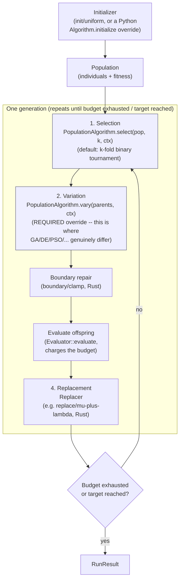

# Anatomy of a population-based algorithm

Almost every population-based metaheuristic — genetic algorithms,
differential evolution, particle swarms, and the whole "nature-inspired"
family — is the same four-stage loop, repeated until the evaluation budget
runs out:

1. **Initialization** — build a starting population of candidate points.
2. **Selection** — choose which current individuals get to produce
   offspring (often biased toward better-fitness individuals).
3. **Variation** — turn the selected individuals into new candidate points
   (mutation, crossover, a differential step, a velocity update, ...).
4. **Replacement** — decide which of {current population, new candidates}
   survives into the next generation.

The algorithms differ almost entirely in what happens at stage 3 —
*variation* is where "genetic algorithm" and "differential evolution" and
"particle swarm" actually diverge — while stages 1, 2, and 4 are far more
interchangeable across algorithm families.

## The loop, and sezgi's own separation of it

sezgi's Rust engine (`crates/core/src/engine.rs`) runs exactly this loop
for every algorithm, built-in or user-authored: one `Initializer` seeds the
population once; then, every generation, each configured stage runs its
`Generator` (produce offspring), a boundary repair, an evaluation, and its
`Replacer` (decide what survives) in sequence, until the budget is
exhausted or a target fitness is reached.

`sezgi.PopulationAlgorithm` (`py-sezgi/python/sezgi/algorithm.py`) exposes
selection and variation as two independently overridable Python methods —
`select(self, pop, k, ctx)` (default: k-fold binary tournament) and
`vary(self, parents, ctx)` (no default; this is the one method every
subclass must implement) — and composes them into `generate(self, pop,
ctx)` for you. Overriding `vary()` alone, and inheriting the default
tournament `select()`, is the clearest possible demonstration that
selection and variation are genuinely separable stages, not one fused step:

```python exec="true" source="above"
import sezgi

class ShrinkingGaussianStep(sezgi.PopulationAlgorithm):
    """Overrides vary() only -- select() keeps the base's default
    tournament selection untouched."""
    def vary(self, parents, ctx):
        offspring = []
        for x in parents:
            step = [ctx.rng.next_f64() * 0.4 - 0.2 for _ in x]
            offspring.append([xi + si for xi, si in zip(x, step)])
        return offspring

problem = sezgi.bbob(1, 3, 1)
result = ShrinkingGaussianStep().run(problem, budget=500, seed=1, pop_size=20)
print(f"evals_used={result.evals_used} best_f={result.best_f:.6g}")
```

`ShrinkingGaussianStep` never mentions selection at all; it inherits
`PopulationAlgorithm.select`'s tournament implementation unchanged, and
`generate()` is never overridden either — the base class already wires
`select()` then `vary()` together for you (`algorithm.py`'s
`PopulationAlgorithm.generate`).

## The generation loop, with the two Python-overridable stages marked



<!-- Source: crates/core/src/engine.rs (`Engine::run`'s per-stage generate -> boundary repair -> evaluate -> replace loop, lines 149-235); py-sezgi/python/sezgi/algorithm.py (`PopulationAlgorithm.select`/`vary`/`generate`, the two Python-overridable stages highlighted above) -->

## Next

- [Exploration vs exploitation](03-exploration-vs-exploitation.md) looks at
  what actually happens *inside* the variation stage's step size.
