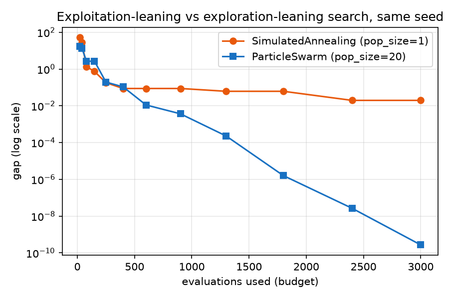
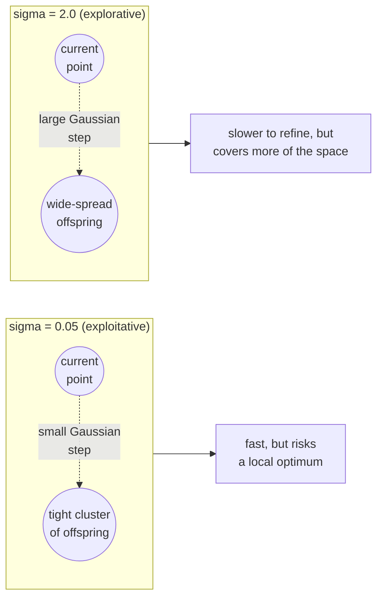

# Exploration vs exploitation

Every metaheuristic balances two competing needs at every generation:

- **Exploration** — sample far from what has been seen so far, to avoid
  missing a better region of the search space entirely.
- **Exploitation** — sample close to what already looks good, to refine a
  promising point into a precise one.

Too much exploration and the search never converges (it behaves like
random search); too much exploitation and it converges *fast* — to
whichever local optimum it happened to start near. This trade-off is
almost always exposed as a tunable **step-size parameter**: `sigma` for a
Gaussian mutation, `w`/`c1`/`c2` for particle swarm inertia/attraction,
`t0`/`alpha` for simulated-annealing temperature, or an explicit decay
schedule.

## One wrapper class, two parameterizations

`sezgi.EvolutionStrategy` wraps `sezgi.presets.es_mu_plus_lambda`
(`crates/components/src/presets.rs:56-70`), whose Rust binding
(`preset_es_mu_plus_lambda`, `py-sezgi/src/lib.rs`) exposes `sigma` — the
standard deviation of the Gaussian mutation step applied at every
generation — directly as a constructor keyword:

```python exec="true" source="above"
import sezgi

problem = sezgi.bbob(1, 5, 1)
budget, seed = 1500, 3

exploit = sezgi.EvolutionStrategy(pop_size=20, sigma=0.05).run(problem, budget=budget, seed=seed)
explore = sezgi.EvolutionStrategy(pop_size=20, sigma=2.0).run(problem, budget=budget, seed=seed)

print(f"small step  (sigma=0.05, exploitative): best_f={exploit.best_f:.6g}")
print(f"large step  (sigma=2.0, explorative):   best_f={explore.best_f:.6g}")
```

The same algorithm, the same problem, the same budget and seed — only
`sigma` changes. A small `sigma` takes tiny, exploitative steps around
whatever the initial population landed near; a large `sigma` explores
farther per generation, at the cost of precision once it does find a good
region. Neither setting is "correct" in general — which one wins on *this*
run says nothing about which wins on a different problem or seed (see
[Comparing algorithms fairly](05-comparing-algorithms-fairly.md)).

## A schedule, not just a constant

Some algorithms do not leave this trade-off as a fixed constant at all —
they *schedule* it to shift from exploration toward exploitation as the
budget is consumed. `sezgi`'s Grey Wolf Optimizer preset is a literal,
readable example:

```text
a = 2 - 2 * progress          // progress = evaluations_used / budget
```

(`crates/components/src/gwo.rs:75-76`) — `a` starts at `2` (wide,
explorative candidate spread around the pack leaders) and decays linearly
to `0` (candidates collapse onto the leaders) as the run's budget is
consumed. This is the same trade-off as the `sigma` example above, expressed
as a schedule instead of a caller-chosen constant.

## Two whole algorithms, the same trade-off

The `sigma` comparison above holds one algorithm fixed and varies a
parameter. The figure below contrasts two DIFFERENT algorithms that sit at
opposite ends of this same spectrum by design: `SimulatedAnnealing`
(`pop_size=1`, a single trajectory that commits hard to descending once
cooled — exploitation-leaning) and `ParticleSwarm` (`pop_size=20`, a
population sharing one global-best attractor — exploration-leaning until
its particles converge together):



## The trade-off as a diagram



<!-- Source: crates/components/src/presets.rs:56-70 (`es_mu_plus_lambda`, gen/step + replace/mu-plus-lambda); py-sezgi/src/lib.rs (`preset_es_mu_plus_lambda`'s `sigma` keyword); crates/components/src/gwo.rs:75-76 (the `a = 2 - 2*progress` explore-to-exploit decay schedule) -->

## Next

- [Encodings and search spaces](04-encodings-and-search-spaces.md) covers
  the other modeling decision every problem author makes: what a candidate
  point actually *is*.
