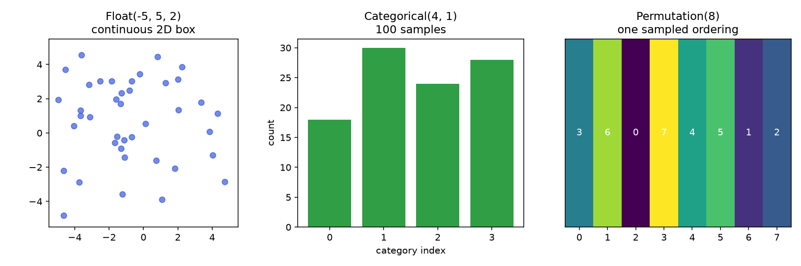
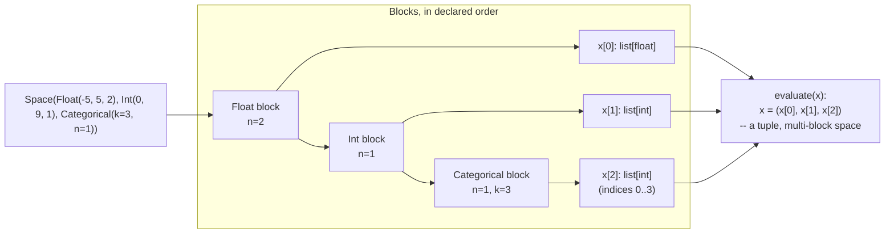

# Encodings and search spaces

Before an algorithm can search anything, a problem author must decide what
a candidate solution *is* — its **encoding**. This is a modeling decision,
not an implementation detail: the same real-world problem can be encoded
several different ways, and the encoding determines which operators
(mutation, crossover, repair) even make sense.

sezgi's search spaces are built from five block kinds
(`crates/core/src/space.rs:13-18`, mirrored 1:1 by
`py-sezgi/python/sezgi/spaces.py`):

| Block | Python builder | Genotype → Python type | Typical use |
|---|---|---|---|
| Continuous | `sezgi.Float(lo, hi, n)` | `list[float]` | tunable real-valued parameters |
| Integer | `sezgi.Int(lo, hi, n)` | `list[int]` | counts, discretized parameters |
| Categorical | `sezgi.Categorical(k, n)` | `list[int]` (indices `0..k`) | unordered choices (kernel type, ...) |
| Binary | `sezgi.Binary(n)` | `list[bool]` | inclusion masks, on/off flags |
| Permutation | `sezgi.Permutation(n)` | `list[int]` (a permutation of `range(n)`) | orderings, tours, schedules |

The conversion table above (`py-sezgi/python/sezgi/problem.py`'s module
docstring) is exactly what `evaluate(x)` receives: a single-block space's
`x` is that block's own converted value, passed bare; a multi-block space's
`x` is a tuple of per-block values, in `space()`'s declared order.

## One `Problem` per encoding shape

```python exec="true" source="above"
import sezgi

continuous = sezgi.bbob(1, 3, 1)
print("continuous:  ", [b["kind"] for b in continuous.blocks()])

integers = sezgi.problems.int_quadratic(lo=0, hi=20, n=4)
print("integer:     ", [b["kind"] for b in integers.blocks()])

categorical = sezgi.problems.cat_match(k=4, n=6, seed=1)
print("categorical: ", [b["kind"] for b in categorical.blocks()])

binary = sezgi.problems.onemax(n_bits=16)
print("binary:      ", [b["kind"] for b in binary.blocks()])

permutation = sezgi.problems.tsp("berlin52")
print("permutation: ", [b["kind"] for b in permutation.blocks()])

mixed = sezgi.problems.mixed_diagnostic(n_float=2, n_int=2, k_cat=3, n_cat=2, n_bin=3)
print("mixed:       ", [b["kind"] for b in mixed.blocks()])
```

Every one of these is a real, runnable `sezgi.Problem` handle — none of
them are illustrative stand-ins. The mixed-space handle
(`sezgi.problems.mixed_diagnostic`) composes four block kinds into one
`Space`, exactly the way `sezgi.Space(Float(...), Int(...), ...)` composes
your own blocks.

## Why the encoding is not a free choice

The encoding literally selects which operator set an algorithm can use.
`sezgi.GeneticAlgorithm` auto-dispatches to one of five presets based on
the problem's own block kind — `ga_real` for all-Float, `ga_perm` for
all-Permutation, `ga_bin` for all-Binary, `ga_int` for all-Int, `ga_cat`
for all-Categorical (`py-sezgi/python/sezgi/builtins.py`'s
`GeneticAlgorithm._resolve_representation`) — because a crossover operator
that makes sense on a permutation (order-preserving, no repeated city) is
meaningless applied to an independent-bit binary string, and vice versa. A
multi-block space whose blocks all share one kind auto-dispatches through
`gen/compound` inside `GeneticAlgorithm` (one generator copy per block).
A space that **mixes** block kinds has no single `ga_*` preset, so
`GeneticAlgorithm` rejects it. Since 0.1.3 `gen/compound`
(`crates/components/src/compound.rs`) accepts any registered generator that
is stateless, pop-to-pop and free of internal evaluation, and 11 presets
(`DifferentialEvolution` rand1/best1, `GreyWolfOptimizer`,
`WhaleOptimization`, `SineCosineAlgorithm`, `JAYA`,
`GrasshopperOptimization`, `SalpSwarm`, `FireflyAlgorithm`,
`FlowerPollination`, `TLBO`, `CuckooSearch`) auto-dispatch on a mixed
space to a **hybrid**: the preset's own generator on float blocks, GA
variation on binary/int/categorical/permutation blocks, with parent
selection and replacement following the preset's own pipeline. A space with
no float block gets zero preset-specific variation (all variation is GA).

```python
import sezgi

class Mixed(sezgi.Problem):
    def space(self):
        return sezgi.Space(sezgi.Float(-5.0, 5.0, 4), sezgi.Binary(6))

    def evaluate(self, x):
        floats, bits = x
        return sum(v * v for v in floats) + sum(1 for b in bits if not b)

# DE varies the float block, GA variation (gen/ga-bin) the binary block.
result = sezgi.DifferentialEvolution().run(Mixed(), budget=2000, seed=7)
```

## Three block kinds, sampled

The figure below shows what three of these encodings actually LOOK like,
sampled directly from the engine's own initial-population sampler (the
same `init/uniform` path every algorithm's `run()` seeds from, captured
via the `generate()` hook Tutorial 3 teaches): a continuous `Float(-5, 5,
2)` box, a `Categorical(4, 1)` choice sampled 100 times, and one
`Permutation(8)` ordering:



## A composed space, block by block



<!-- Source: crates/core/src/space.rs:13-18 (the `Block` enum, five kinds); py-sezgi/python/sezgi/spaces.py (`Float`/`Int`/`Categorical`/`Binary`/`Permutation`/`Space` builders); py-sezgi/python/sezgi/problem.py (the genotype -> Python conversion table, bare-vs-tuple rule) -->

## Next

- [Comparing algorithms fairly](05-comparing-algorithms-fairly.md) puts a
  single run like the ones above into proper statistical context.
