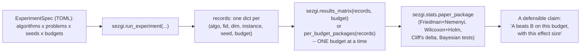

# Comparing algorithms fairly

Every earlier page in this track ran one algorithm, once, on one problem,
at one budget, from one seed — and each time said, in one form or another,
that a single run proves nothing. This page explains why, and shows the
sezgi surface built for doing better.

## What a single run cannot tell you

A metaheuristic draws random numbers at almost every stage (initialization,
variation, sometimes replacement). Changing only the seed changes the
run's entire trajectory. A single seeded comparison between two algorithms
answers "which one got luckier on this seed", not "which algorithm is
better on this problem" — the difference could easily reverse on the next
seed. sezgi's own examples catalog states this as a standing policy
(`examples/README.md`): *"No cross-algorithm quality claims are made
anywhere in this catalog or its scripts — these are single-seed,
single-problem runs, reported as a gap against the problem's known
optimum, never as a ranking between algorithms."* This page's snippet
follows the same discipline.

A trustworthy comparison needs, at minimum:

- **A fixed, stated budget** — comparing algorithms at different budgets
  compares nothing meaningful.
- **Multiple seeds (replications)** — enough runs per algorithm to see the
  *distribution* of outcomes, not one point from it.
- **A benchmark suite, not one hand-picked function** — sezgi ships BBOB
  (`sezgi.bbob`) and three CEC generations
  (`sezgi.problems.cec2022/2014/2017`) precisely so a comparison is not
  accidentally tuned to one function's quirks.
- **A statistical test, not eyeballing the mean** — means hide variance;
  a formal test (or its Bayesian counterpart) is what turns "algorithm A's
  mean gap was smaller" into a defensible claim.

## Fifteen seeds, one honest test

```python exec="true" source="above"
import sezgi

problem = sezgi.bbob(1, 5, 1)
budget = 800
seeds = range(15)

rs_gaps = [sezgi.RandomSearch(pop_size=20).run(problem, budget=budget, seed=s).gap
           for s in seeds]
de_gaps = [sezgi.DifferentialEvolution(pop_size=20).run(problem, budget=budget, seed=s).gap
           for s in seeds]

print(f"random_search:  mean gap over {len(seeds)} seeds = {sum(rs_gaps)/len(rs_gaps):.6g}")
print(f"diff_evolution: mean gap over {len(seeds)} seeds = {sum(de_gaps)/len(de_gaps):.6g}")

w = sezgi.stats.wilcoxon(rs_gaps, de_gaps)
print(f"wilcoxon signed-rank: p_value={w['p_value']:.4g} method={w['method']}")

delta = sezgi.stats.cliffs_delta(rs_gaps, de_gaps)
print(f"cliffs_delta={delta:.4g} ({sezgi.stats.cliffs_magnitude(delta)})")
```

This is still a small, single-problem illustration — a real comparison
would sweep several BBOB/CEC functions and dimensions and use many more
seeds — but the *mechanics* above (paired per-seed gaps, a signed-rank
test, an effect-size magnitude) are the real ones sezgi ships, not a
simplified stand-in.

## The fuller pipeline, honestly

For a genuine multi-algorithm, multi-problem study, `sezgi.run_experiment`
runs an `ExperimentSpec` (parsed from TOML) across every
(algorithm, problem, seed) combination and returns one record per run;
`sezgi.results_matrix`/`sezgi.per_budget_packages` aggregate those records
into a `sezgi.stats.paper_package` — the one-call bundle of Friedman +
Nemenyi CD, Wilcoxon + Holm correction, Cliff's delta, and (optionally)
Bayesian signed-rank/Plackett-Luce, all at once. `per_budget_packages`
deliberately builds one package **per budget** rather than pooling budgets
together: Piotrowski et al. (2025) show that algorithm rankings on
benchmark comparisons can flip depending on which evaluation budget is
examined, so sezgi makes multi-budget reporting the default instead of an
arbitrarily chosen single number. See the
[Statistics](../api/stats.md) API reference for the full test surface.

## The comparison pipeline, as a diagram



<!-- Source: py-sezgi/python/sezgi/__init__.py (`run_experiment`, `results_matrix`, `per_budget_packages`); py-sezgi/src/lib.rs (`stats_friedman`, `stats_wilcoxon`, `stats_cliffs_delta`, `stats_cliffs_magnitude`); examples/README.md (the "no cross-algorithm quality claims" policy quoted above) -->

## Next

- [Reading convergence curves](06-reading-convergence-curves.md) covers
  how to read the *shape* of a single run's progress, once you already
  know not to compare algorithms from one such shape alone.
