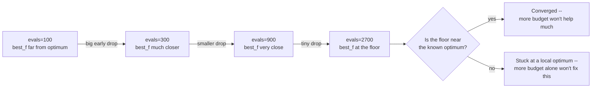

# Reading convergence curves

A convergence curve plots an algorithm's **best-so-far** fitness against
evaluations used. It is the standard way to look at how a run actually
behaved, not just where it ended up — two runs with the same final `best_f`
can have gotten there completely differently (one steady, one stuck-then-
jumping), and that difference matters when choosing an algorithm or a
budget.

!!! note "Figure note"
    This page describes what a convergence curve shows and sketches its
    shape conceptually (below). A rendered matplotlib figure over a real
    logged run arrives in a later milestone task; this page does not link
    to it, so nothing here breaks under a strict build.

## Anytime behavior, read without a plot

Because sezgi runs are deterministic under a fixed `(problem, budget,
seed)` (see [Determinism and the RNG model](../concepts/rng-and-determinism.md)),
truncating the *same* seeded run at successively larger budgets reproduces
exactly what that run's own trajectory looked like at each point — an
"anytime" view without needing a live plot:

```python exec="true" source="above"
import sezgi

problem = sezgi.bbob(1, 5, 1)
seed = 1

# Same seed, increasing budgets: each row is where THIS SAME run's
# trajectory stood at that many evaluations -- not four independent runs.
for budget in (100, 300, 900, 2700):
    result = sezgi.DifferentialEvolution(pop_size=20).run(problem, budget=budget, seed=seed)
    print(f"budget={budget:5d} best_f={result.best_f:12.6g} gap={result.gap:12.6g}")
```

Reading this table: the gap drops by roughly an order of magnitude between
`budget=100` and `budget=300`, then keeps dropping but by less each step —
a **plateau approaching a floor**, not a stall. Whether a plateau means
"converged" or "stuck" cannot be told from the numbers alone; it depends on
whether the floor is close to the problem's known optimum (as it is here,
`f_opt` for BBOB f1 is known) or far from it.

## Three honest ways to view the same run

- **Raw best-so-far vs. evaluations** — the direct view above; useful for
  seeing absolute progress, but a log-scale y-axis is usually needed once
  the gap gets small, since linear scale flattens everything past the
  first big drop.
- **Log-gap vs. evaluations** (`best_f - f_opt`, log-scaled) — makes the
  "orders of magnitude per generation" behavior in the table above directly
  visible as roughly straight-line segments.
- **ECDF (empirical cumulative distribution of hitting-times)** —
  `sezgi.ecdf(log_root, targets=...)` reads back an on-disk IOH-format log
  tree (written via `run(..., log_dir=...)` or `run_experiment(...,
  log_dir=...)`) and reports, across many runs and precision targets, the
  *proportion* that have reached each target by a given evaluation count —
  the standard way to summarize anytime performance over many seeds at
  once, rather than reading one curve at a time. See
  `sezgi.read_ioh_records`/`sezgi.coco_export` for the rest of that logging
  surface.

## The shape of a plateau, sketched



<!-- Source: crates/core/src/engine.rs (deterministic per-seed trajectory, so a budget-truncated re-run reproduces the same run's own history); py-sezgi/python/sezgi/__init__.py (`ecdf`, `read_ioh_records`, `coco_export` -- the IOH-logging-backed anytime-view surface) -->

## Next

- [Engine flow](../concepts/engine-flow.md) opens the architecture section:
  exactly what the Rust engine does, once per generation, to produce the
  numbers this whole Learn track has been printing.
