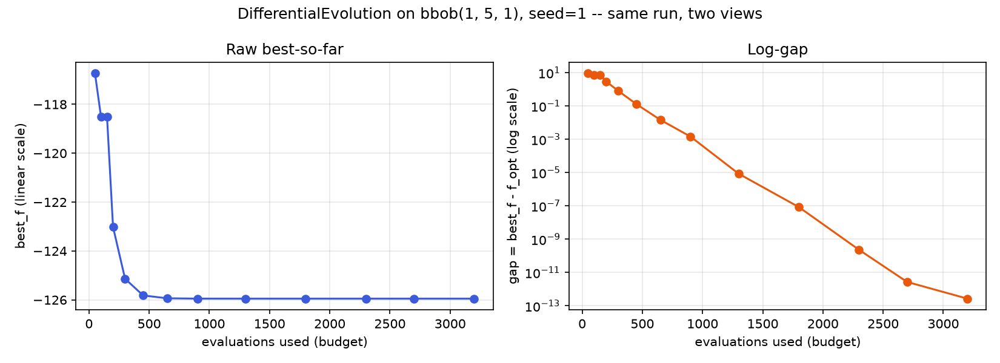
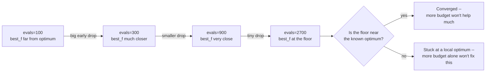

# Reading convergence curves

A convergence curve plots an algorithm's **best-so-far** fitness against
evaluations used. It is the standard way to look at how a run actually
behaved, not just where it ended up — two runs with the same final `best_f`
can have gotten there completely differently (one steady, one stuck-then-
jumping), and that difference matters when choosing an algorithm or a
budget.

## The curve, rendered

`docs/scripts/fig_budget_anytime_curve.py` runs exactly the scenario
walked through by hand below (`DifferentialEvolution(pop_size=20)` on
`bbob(1, 5, 1)`, seed=1) at a denser set of budgets, plotted both ways —
raw best-so-far and log-gap, side by side:



## Anytime behavior, read without a plot

Because sezgi runs are deterministic under a fixed `(problem, budget,
seed)` (see [Determinism and the RNG model](../concepts/rng-and-determinism.md)),
four *independent* same-seeded runs at increasing budgets line up with
one run's own trajectory here — but only because every budget below is a
whole multiple of the population size (each run completes whole
generations) and `DifferentialEvolution`'s generator does not adapt to
the budget. At a budget that cuts a generation short, or with a
budget-adaptive algorithm such as `LSHADE`, independent runs can diverge
from the long run's prefix (the quickstart's convergence section shows a
concrete counterexample):

```python exec="true" source="above"
import sezgi

problem = sezgi.bbob(1, 5, 1)
seed = 1

# Four independent same-seeded runs. They reproduce one long run's
# trajectory here because each budget completes whole generations
# (multiples of pop_size=20) and this generator is not budget-adaptive.
for budget in (100, 300, 900, 2700):
    result = sezgi.DifferentialEvolution(pop_size=20).run(problem, budget=budget, seed=seed)
    print(f"budget={budget:5d} best_f={result.best_f:12.6g} gap={result.gap:12.6g}")
```

Reading this table: in **absolute** terms the gap's improvement shrinks
each step (`7.45 → 0.81 → 0.0015 → ~0`) — the curve flattens toward a
floor, not a stall. But on a **log scale** (the natural scale for a gap
approaching zero) the rate is not slowing down at all: roughly one order
of magnitude between `budget=100` and `300`, then over *two* orders of
magnitude between `300` and `900`, then over *eight* between `900` and
`2700` — the relative rate of improvement is accelerating here, which is
exactly the fast local convergence a differential-evolution-style search
shows once it is inside the right basin. A **plateau approaching a floor**
still describes the absolute-scale shape, but "diminishing returns" would
be the wrong read of the log-scale one. Whether the floor itself means
"converged" or "stuck" cannot be told from either view alone; it depends
on whether the floor is close to the problem's known optimum (as it is
here, `f_opt` for BBOB f1 is known) or far from it.

## Three honest ways to view the same run

- **Raw best-so-far vs. evaluations** — the direct view above; useful for
  seeing absolute progress, but a log-scale y-axis is usually needed once
  the gap gets small, since linear scale flattens everything past the
  first big drop.
- **Log-gap vs. evaluations** (`best_f - f_opt`, log-scaled) — makes the
  "orders of magnitude per generation" behavior in the table above directly
  visible as roughly straight-line segments.
- **ECDF (empirical cumulative distribution of hitting-times)** —
  `sezgi.ecdf(log_root, targets=...)` reads back an on-disk IOH-format log
  tree (written via `run(..., log_dir=...)` or `run_experiment(...,
  log_dir=...)`) and reports, across many runs and precision targets, the
  *proportion* that have reached each target by a given evaluation count —
  the standard way to summarize anytime performance over many seeds at
  once, rather than reading one curve at a time. See
  `sezgi.read_ioh_records`/`sezgi.coco_export` for the rest of that logging
  surface.

## The shape of a plateau, sketched



<!-- Source: crates/core/src/engine.rs (deterministic per-seed trajectory, so a budget-truncated re-run reproduces the same run's own history); py-sezgi/python/sezgi/__init__.py (`ecdf`, `read_ioh_records`, `coco_export` -- the IOH-logging-backed anytime-view surface) -->

## Next

- [Engine flow](../concepts/engine-flow.md) opens the architecture section:
  exactly what the Rust engine does, once per generation, to produce the
  numbers this whole Learn track has been printing.
