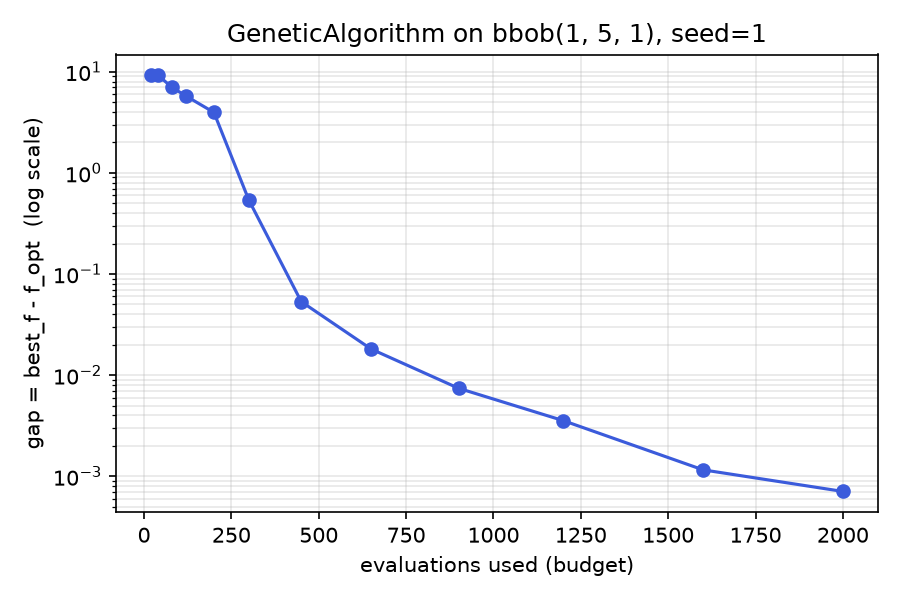

# Tutorial 1: Your first optimization

This tutorial walks through the shortest real path from "nothing imported"
to "a finished, reproducible run": pick a benchmark problem, pick a
built-in algorithm class, call `.run()`, and read every field of the
result it returns. It exercises exactly what the
[Quickstart](../quickstart.md) shows in ten lines, slower and with every
field explained.

## The problem: a BBOB benchmark handle

`sezgi.bbob(fid, dim, instance)` returns a native `Problem` handle for one
of the 24 noiseless BBOB/COCO functions — no subclassing needed, since
this problem's objective and known optimum already live compiled into the
Rust core.

```python exec="true" source="above"
import sezgi

problem = sezgi.bbob(1, 5, 1)  # f1 = Sphere, dim=5, instance=1
print(type(problem))
```

`fid=1` is the Sphere function (`f(x) = sum(x_i^2)`, a smooth, unimodal,
easy baseline), `dim=5` is the search dimension, `instance=1` selects one
of BBOB's own randomized instance transformations (a fixed rotation/shift
applied to the base function — a different `instance` is a different,
still-Sphere-shaped, still-solvable problem; the same `instance` always
transforms the same way).

## The algorithm: a wrapper class

Every built-in algorithm in sezgi is a class in `sezgi.builtins`, imported
directly off the top-level `sezgi` namespace. `GeneticAlgorithm` is one of
the ~30 preset-backed wrapper classes — its constructor takes algorithm
hyperparameters (`pop_size` here), and its `.run()` method takes the
per-run arguments (`problem`, `budget`, `seed`).

```python exec="true" source="above"
import sezgi

problem = sezgi.bbob(1, 5, 1)
algo = sezgi.GeneticAlgorithm(pop_size=20)
result = algo.run(problem, budget=1000, seed=1)
print(result)
```

`GeneticAlgorithm` auto-dispatches on the problem's own space kind: a BBOB
handle declares a continuous `Float` space, so this call delegates
internally to `sezgi.presets.ga_real` — a categorical or binary problem
would dispatch to a different preset of the same class instead (see
[Built-in algorithm classes](../api/builtins.md)). `budget=1000` is the
total number of objective-function evaluations this run is allowed;
`seed=1` fixes every random draw the run makes, so the SAME
`(problem, budget, seed)` triple always reproduces the SAME `result`,
bit-for-bit, in this build and from the R frontend for a shared algorithm
(see [Determinism and the RNG model](../concepts/rng-and-determinism.md)).

## Every field of the result

`SolveResult` — the return type of every wrapper class's `.run()` (and of
`Algorithm.run()`/`AskTellAlgorithm.solve()`, the two other front doors —
one shape everywhere except `NSGA2`, see Tutorial 7) — carries eight
fields:

```python exec="true" source="above"
import sezgi

problem = sezgi.bbob(1, 5, 1)
result = sezgi.GeneticAlgorithm(pop_size=20).run(problem, budget=1000, seed=1)

print(f"algo        = {result.algo!r}")
print(f"seed        = {result.seed}")
print(f"budget      = {result.budget}")
print(f"evals_used  = {result.evals_used}")
print(f"best_x[:3]  = {result.best_x[:3]}")
print(f"best_f      = {result.best_f:.6g}")
print(f"f_opt       = {result.f_opt:.6g}")
print(f"gap         = {result.gap:.6g}")
```

- **`algo`** — the preset name that actually ran (`"ga_real"` here, not
  `"geneticalgorithm"` — useful precisely because `GeneticAlgorithm`
  auto-dispatches, so this tells you which preset your problem's space
  routed to).
- **`seed`**, **`budget`**, **`evals_used`** — the run's own bookkeeping.
  `evals_used` equals `budget` unless the algorithm terminates early (no
  built-in class does today, but the field exists for algorithms that
  could).
- **`best_x`** — the best point this run actually *evaluated*, as a plain
  `list[float]` (dim=5, so 5 entries) for this Float-typed problem. Not
  guaranteed to lie within the problem's declared bounds for every
  algorithm (an unconstrained-step algorithm can propose outside them
  before the engine's own boundary repair runs — see `sezgi.solve`'s own
  docstring on the [Solve / compat internals](../api/compat.md) page).
- **`best_f`** — the objective value at `best_x`.
- **`f_opt`** — this problem's known optimum. BBOB functions ship an exact
  optimum, so this is a real float, not `None` — a problem with no known
  optimum (Tutorial 4's local-search TSP instance, for example) reports
  `f_opt=None` and `gap=None` instead.
- **`gap`** — `best_f - f_opt`, the standard way to report a single run's
  quality without any cross-algorithm claim attached to it (see
  [Comparing algorithms fairly](../learn/05-comparing-algorithms-fairly.md)
  for why a gap number alone is not a ranking).

## A look at convergence

The figure below is generated by `docs/scripts/fig_convergence_curve.py` —
the SAME `(problem, algorithm, seed)` as above, re-run at 12 increasing
budgets, each budget its own independent `.run()` call.
`GeneticAlgorithm`'s generator never reads the total budget while it runs
(unlike budget-adaptive presets such as `lshade`), so an independent run
at a smaller budget lands on the same point a longer run with the same
seed would have reached, *whenever the two runs complete the same number
of generations* — true at 11 of the 12 budgets plotted here (the one
exception, `budget=450`, stops one partial generation short of where a
longer run's own trajectory stood at evaluation #450, since the engine
only evaluates whole generation batches; see
[Reading convergence curves](../learn/06-reading-convergence-curves.md)
for a related but distinct technique — reconstructing an anytime view
from a SINGLE logged run instead of many independent ones):



The gap drops by roughly four orders of magnitude between `budget=300` and
`budget=2000` — the fast, smooth descent typical of a real-coded GA on an
easy, unimodal function like Sphere.

## Next

- [Defining your own Problem](02-your-own-problem.md) — write the
  objective yourself instead of using a shipped benchmark.
- [Reading the result](../quickstart.md#reading-the-result) in the
  Quickstart covers the same eight fields more tersely.
