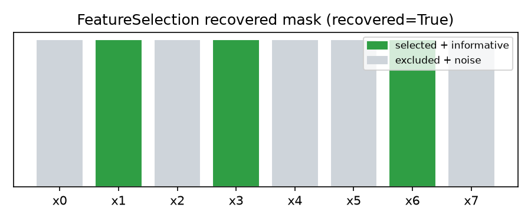

# Tutorial 5: Feature selection recipe, end to end

Tutorial 2 wrote a `Problem` from data by hand. `sezgi.recipes` ships a
ready-made one for the most common "optimize against data" shape: pick a
subset of a dataset's columns. This tutorial builds a synthetic dataset
with a KNOWN answer, runs `FeatureSelection` against it, and checks
whether the search actually finds that answer.

## The recipe

`sezgi.recipes.FeatureSelection(X, y, scorer, penalty=0.0)` wraps a
`Binary(n_features)` search over a 2D dataset's columns: a genotype is a
length-`n_features` boolean mask, `True` selecting a column.
`scorer(X_sub, y) -> float` is caller-supplied and MUST follow a
MINIMIZE convention (a loss/error metric, never an accuracy-style score —
an sklearn accuracy scorer needs its sign flipped first). Because
`Binary` is a single-kind space, `GeneticAlgorithm` auto-dispatches
straight to `sezgi.presets.ga_bin` — no custom `Algorithm` needed for this
recipe.

`evaluate(mask) = scorer(X[:, mask], y) + penalty * (popcount(mask) /
n_features)` — the penalty term is a FRACTION of the full feature count,
so a pure-`scorer` search (`penalty=0.0`) has no preference for smaller
subsets, while a positive `penalty` biases the search toward them. This
matters because in-sample residual error can never get worse by adding
MORE columns (a pure-noise column can only help or do nothing) — without
a penalty term, a residual-based scorer would over-select every column
regardless of whether it is informative.

## A dataset with a known answer

```python exec="true" source="above"
import numpy as np

import sezgi
from sezgi.recipes import FeatureSelection

SEED = 98
N_SAMPLES, N_FEATURES = 20, 8
INFORMATIVE = (1, 3, 6)          # the columns that actually determine y
COEFS = np.array([3.0, -2.0, 1.5])
NOISE_STD = 0.2
PENALTY = 0.3

rng = np.random.default_rng(SEED)
X = rng.standard_normal((N_SAMPLES, N_FEATURES))
noise = rng.normal(scale=NOISE_STD, size=N_SAMPLES)
y = X[:, INFORMATIVE] @ COEFS + noise  # 3 informative columns, 5 pure-noise ones

print(f"X.shape={X.shape}  informative columns={INFORMATIVE}")
```

Five of the eight columns are pure noise, uncorrelated with `y` beyond
sampling coincidence; the other three linearly determine `y` up to
Gaussian noise. `scorer` below is ordinary least squares (with an
intercept column), a minimal dependency-free stand-in for a real
cross-validated model score. This block redeclares the dataset above (each
executed block on this page runs in its own fresh namespace) so it stands
on its own:

```python exec="true" source="above"
import numpy as np

import sezgi
from sezgi.recipes import FeatureSelection

SEED = 98
N_SAMPLES, N_FEATURES = 20, 8
INFORMATIVE = (1, 3, 6)
COEFS = np.array([3.0, -2.0, 1.5])
NOISE_STD = 0.2
PENALTY = 0.3

rng = np.random.default_rng(SEED)
X = rng.standard_normal((N_SAMPLES, N_FEATURES))
noise = rng.normal(scale=NOISE_STD, size=N_SAMPLES)
y = X[:, INFORMATIVE] @ COEFS + noise


def scorer(X_sub, y):
    """OLS residual sum of squares -- lower is better."""
    design = np.column_stack([np.ones(X_sub.shape[0]), X_sub])
    coefs, *_ = np.linalg.lstsq(design, y, rcond=None)
    resid = y - design @ coefs
    return float(np.sum(resid ** 2))


problem = FeatureSelection(X, y, scorer, penalty=PENALTY)
result = sezgi.GeneticAlgorithm(pop_size=20).run(problem, budget=200, seed=42)

mask = tuple(bool(v) for v in result.best_x)
informative_mask = tuple(i in INFORMATIVE for i in range(N_FEATURES))
mask_str = "".join("1" if v else "0" for v in mask)

print(f"evals_used={result.evals_used} best_f={result.best_f:.6g}")
print(f"mask      = {mask_str}")
print(f"true mask = {''.join('1' if v else '0' for v in informative_mask)}")
print(f"recovered = {mask == informative_mask}")
```

The search recovers the exact informative-column mask at this
`(dataset, penalty, budget, seed)` — worth restating honestly: this is one
seeded run on one synthetic dataset built precisely so the informative
columns are the global minimum (`test_oop_recipes.py`'s own brute-force
check over all `2**8 = 256` masks cross-verifies this), not a claim that
feature selection recovers the truth in general.

## The mask, visually



## Next

- [Mixed-space tuning](06-mixed-space-tuning.md) — the general-purpose
  sibling, `sezgi.recipes.MixedTuning`, for a space that is not just a
  Binary mask.
