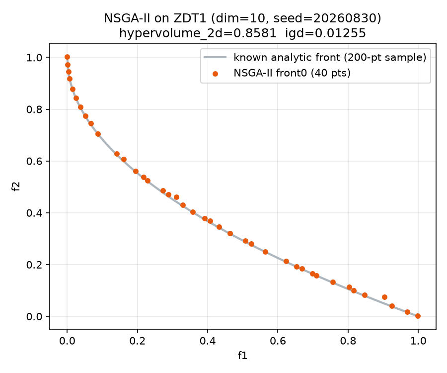

# Tutorial 7: Multi-objective optimization with NSGA-II

Every tutorial so far returned a `SolveResult` — one `best_x`, one
`best_f`. NSGA-II (Deb, Pratap, Agarwal & Meyarivan 2002) optimizes
SEVERAL objectives at once, where no single point is "best" — instead it
returns a whole POPULATION and marks which members are non-dominated (the
Pareto front). `sezgi.NSGA2` is deliberately the one built-in wrapper
class whose `.run()` does NOT return `SolveResult` — this tutorial states
that exception plainly and shows exactly what it returns instead.

## The result shape exception, stated honestly

`sezgi.NSGA2(pop_size=...).run(...)` returns `sezgi.mo.nsga2`'s OWN dict
shape verbatim — `SolveResult`'s fields (`best_x`/`best_f`/`f_opt`/`gap`)
assume a single-objective run with one best point, which does not fit a
multi-objective Pareto front. This is the ONE builtin wrapper class where
`.run()`'s return type differs from every other class in `sezgi.builtins`
— not an oversight, a documented design choice (see `sezgi.NSGA2`'s own
class docstring).

```python exec="true" source="above"
import sezgi

result = sezgi.NSGA2(pop_size=40).run("zdt1", 10, 4000, seed=20260830)
print(f"result keys: {sorted(result.keys())}")
print(f"population size: {len(result['individuals'])}")
print(f"front0 size (non-dominated members): {len(result['front0'])}")
print(f"evals_used: {result['evals_used']}")
```

`result["individuals"]` — one float-list per final-population member (a
`Binary` block, if present, is flattened to `0.0`/`1.0` — a DIFFERENT
convention than every other wrapper class's typed `best_x`, which is a
documented, per-surface choice, not an inconsistency to fix).
`result["objectives"]` — parallel float-lists, one per objective, per
member. `result["front0"]` — indices into `individuals`/`objectives` of
the non-dominated set. `result["violations"]` is present only for a
constrained problem (not `zdt1`).

## Reading a Pareto front

```python exec="true" source="above"
import sezgi

PROBLEM = "zdt1"
DIM = 10
POP_SIZE = 40
BUDGET = 4000
SEED = 20260830
REF_POINT = [1.1, 1.1]  # ZDT1's objectives lie in [0,1]x[0,1]; 1.1 dominates the whole front

result = sezgi.NSGA2(pop_size=POP_SIZE).run(PROBLEM, DIM, BUDGET, seed=SEED)
front0_objectives = [result["objectives"][i] for i in result["front0"]]
reference_front = sezgi.mo.pareto_front(PROBLEM, DIM, n=200)

hv = sezgi.mo.hypervolume_2d(front0_objectives, REF_POINT)
igd_value = sezgi.mo.igd(front0_objectives, reference_front)

print(f"problem={PROBLEM} dim={DIM} pop_size={POP_SIZE} budget={BUDGET} seed={SEED}")
print(f"front size: {len(front0_objectives)}")
print(f"hypervolume_2d (ref_point={REF_POINT}): {hv:.6g}")
print(f"igd (vs a 200-point analytic front sample): {igd_value:.6g}")
```

`sezgi.mo.pareto_front(problem, dim, n)` samples `n` points of the
ANALYTIC known-optimal front (when one exists for this problem family —
`None` for problems like WFG1/WFG2 with no closed-form front), so
`hypervolume_2d` (the S-metric: the volume of objective space dominated by
the found front, relative to a reference point — higher is better) and
`igd` (inverted generational distance: how far the found front is from the
true one — lower is better) both have a ground truth to compare against.
Small budget, single seed, single problem — no cross-algorithm quality
claim is made here either (same policy as every other page on this site).

## The front, visually



The orange points (the algorithm's own `front0`) trace the grey analytic
curve closely — the small `igd` value above is exactly this visual
closeness, quantified.

## Why NSGA-II is not authored the `sezgi.Algorithm` way

Authoring an NSGA-II variant as an engine-hosted Python callback (the way
Tutorials 3-6 author a scalar algorithm's `generate()`) is explicitly out
of scope for this milestone: NSGA-II's own selection/crossover/replacement
loop is hard-coded Rust, not routed through the
`Registry`/`AlgorithmSpec`/`Engine`/`Generator` machinery `sezgi.Algorithm`
targets. `sezgi.NSGA2`'s constructor takes the algorithm-configuration
knobs (`pop_size`, `eta_c`, `eta_m`, `p_c`, ..., mirroring `mo.nsga2`'s own
parameters); `run()` takes the per-problem knobs (`problem`, `dim`,
`budget`, `m`, `seed`, ...) — together, `sezgi.NSGA2(pop_size=P,
**op_kwargs).run(problem, dim, budget, seed=S, ...)` is identical to
calling `sezgi.mo.nsga2(problem, dim, P, budget, seed=S, **op_kwargs)`
directly.

## Next

- [Comparing algorithms and statistics](08-comparing-algorithms.md) — back
  to single-objective `SolveResult`s, now compared honestly across many
  seeds.
