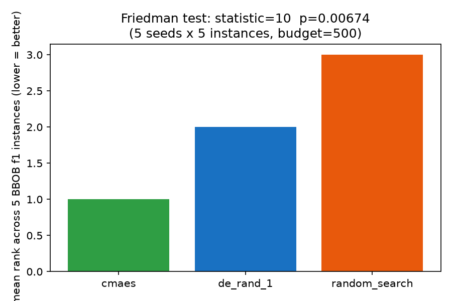

# Tutorial 8: Comparing algorithms and statistics

[Comparing algorithms fairly](../learn/05-comparing-algorithms-fairly.md)
already showed the minimal honest comparison: many seeds, a paired
Wilcoxon test, an effect size. This tutorial goes one step further — three
algorithms, several problems, and `sezgi.run_experiment`'s TOML-grid
surface, the shipped tool for a real multi-algorithm study.

## Multi-seed runs, by hand first

Before reaching for `run_experiment`, the mechanics are just repeated
`.run()` calls with a different seed each time — the same wrapper-class
call from Tutorial 1, looped:

```python exec="true" source="above"
import sezgi

problem = sezgi.bbob(1, 5, 1)
budget = 500
seeds = range(10)

de_gaps = [sezgi.DifferentialEvolution(pop_size=20).run(problem, budget=budget, seed=s).gap
           for s in seeds]
cmaes_gaps = [sezgi.CMAES(pop_size=20).run(problem, budget=budget, seed=s).gap
              for s in seeds]

print(f"diff_evolution: mean gap over {len(seeds)} seeds = {sum(de_gaps)/len(de_gaps):.6g}")
print(f"cmaes:          mean gap over {len(seeds)} seeds = {sum(cmaes_gaps)/len(cmaes_gaps):.6g}")

w = sezgi.stats.wilcoxon(de_gaps, cmaes_gaps)
print(f"wilcoxon signed-rank: p_value={w['p_value']:.4g} method={w['method']}")
```

This is exactly the pattern [Learn 5](../learn/05-comparing-algorithms-fairly.md)
teaches — paired per-seed gaps, one signed-rank test. It scales to two
algorithms on one problem. For three or more algorithms across several
problems, `sezgi.run_experiment` is the tool built for the job.

## `run_experiment`: a TOML grid of algorithms x problems x seeds

`sezgi.run_experiment(spec_toml)` runs an `ExperimentSpec` (parsed from
TOML) across every `(algorithm, problem, seed)` combination and returns
one record dict per run — `algo`, `fid`, `dim`, `instance`, `seed`,
`budget`, `best_f`, `f_opt`, `gap`, `evals_used`, `wall_secs`:

```python exec="true" source="above"
import sezgi

spec_toml = """
name = "tutorial-8-comparison"
seeds = [1, 2, 3, 4, 5]
budgets = [500]

[[algorithms]]
name = "de_rand_1"
preset = { kind = "de_rand_1", pop_size = 20 }

[[algorithms]]
name = "cmaes"
preset = { kind = "cmaes", pop_size = 20 }

[[algorithms]]
name = "random_search"
preset = { kind = "random_search", pop_size = 20 }

[[problems]]
suite = "bbob"
fid = 1
dim = 5
instances = [1, 2, 3, 4, 5]
"""

records = sezgi.run_experiment(spec_toml, parallel=True)
r0 = records[0]
print(f"records: {len(records)}  (3 algorithms x 5 instances x 5 seeds)")
print(f"one record: algo={r0['algo']} fid={r0['fid']} dim={r0['dim']} "
      f"instance={r0['instance']} seed={r0['seed']} budget={r0['budget']} "
      f"best_f={r0['best_f']:.6g} gap={r0['gap']:.6g} evals_used={r0['evals_used']}")
```

(`wall_secs` -- one more field every record carries -- is omitted from the
line above deliberately: it is real wall-clock timing, so it is the one
field in a record that is NOT reproducible run to run, unlike every other
field here.)

`sezgi.results_matrix(records, budget)` aggregates those per-seed records
into one `(algo_names, problem_labels, matrix)` triple — `matrix[i][j]` is
the aggregated gap of algorithm `j` on problem `i`, ready to feed
`sezgi.stats.friedman` (3+ algorithms, non-parametric, a
repeated-measures-ANOVA alternative) directly:

```python exec="true" source="above"
import sezgi

spec_toml = """
name = "tutorial-8-comparison"
seeds = [1, 2, 3, 4, 5]
budgets = [500]

[[algorithms]]
name = "de_rand_1"
preset = { kind = "de_rand_1", pop_size = 20 }

[[algorithms]]
name = "cmaes"
preset = { kind = "cmaes", pop_size = 20 }

[[algorithms]]
name = "random_search"
preset = { kind = "random_search", pop_size = 20 }

[[problems]]
suite = "bbob"
fid = 1
dim = 5
instances = [1, 2, 3, 4, 5]
"""

records = sezgi.run_experiment(spec_toml, parallel=True)
algo_names, problem_labels, matrix = sezgi.results_matrix(records, budget=500)
friedman = sezgi.stats.friedman(matrix)

print(f"algorithms: {algo_names}")
print(f"problems:   {problem_labels}")
print(f"friedman statistic={friedman['statistic']:.4g} p_value={friedman['p_value']:.4g}")
for name, rank in zip(algo_names, friedman["mean_ranks"]):
    print(f"  mean_rank[{name}] = {rank:.3g}")
```

Lower `mean_ranks` is better. At `p_value < 0.05` the null hypothesis
("all three algorithms perform the same") is rejected at this budget, on
this one BBOB function's five instances — still a small illustration (a
real study sweeps several functions and dimensions with many more seeds),
but the mechanics — the TOML grid, `results_matrix`, `stats.friedman` —
are the real ones sezgi ships.

## The mean ranks, visually



## The one-call bundle: `stats.paper_package`

For a paper-ready bundle in one call — Friedman + Nemenyi CD, pairwise
Wilcoxon with Holm correction, pairwise Cliff's delta, and (optionally)
Bayesian signed-rank/Plackett-Luce, all at once —
`sezgi.per_budget_packages(records, rope=0.01, samples=10000, seed=42)`
builds one `sezgi.stats.paper_package` PER DISTINCT BUDGET present in
`records` (never pooled across budgets: rankings can flip between small
and large budgets, so each budget gets its own package). See the
[Statistics](../api/stats.md) API reference for the full test surface, and
[Comparing algorithms fairly](../learn/05-comparing-algorithms-fairly.md)
for the fuller pipeline diagram.

## Next

This closes the tutorial track. Every figure across this site is generated
by a seeded script under `docs/scripts/`, with its plotted data gated by
`py-sezgi/tests/test_docs_figures.py` — re-running any `fig_*.py` script
reproduces its committed sidecar exactly. From here:

- [Examples gallery](../examples.md) — real, runnable scripts covering
  this same ground and more.
- [API reference: Statistics](../api/stats.md) — the full `sezgi.stats.*`
  test surface this tutorial only sampled.
